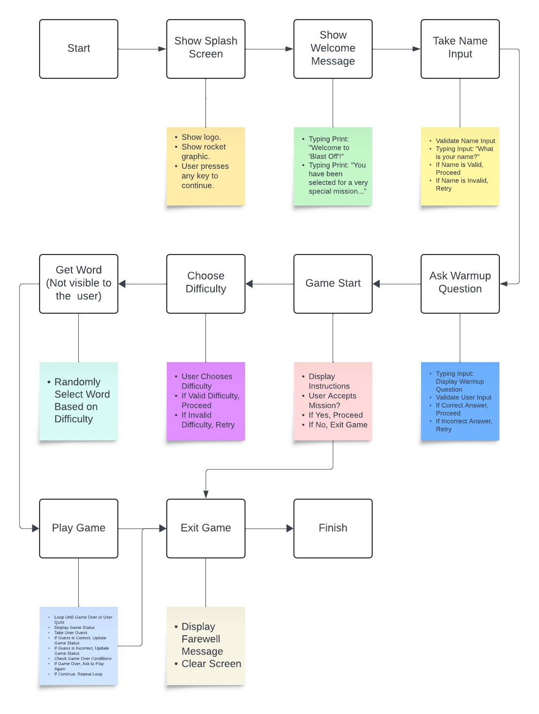

# Blast Off!

## Overview

'Blast off!' is an immersive, educational guessing game for one player with a 'space and the universe' theme. Similar to 'hangman', the player is presented with a series of underscores that represent a word. They must select letters from the alphabet and guess the word to win. This game is run in a mock terminal deployed by Heroku.

Screenshot

In recent years, the traditional hangman game has fallen out of favour with many educators due to sensitivity to violence and a lack of educational value. As a former teacher, I wanted to recreate something that could be used by any teacher in the classroom or child at home.

[Here is the live version of the game](https://blast-off-c6220a01b038.herokuapp.com/).

## How to Play

The game has been designed to be as simple as possible. The player:

1. Must answer a warm-up question to be selected for the mission.
2. Chooses a level of difficulty (junior, senior, chief) – the harder the level, the more abstract the word.
3. Is presented with a series of underscores and must try and guess the word by either selecting individual letters or by 4. writing the word itself.
5. Has 6 turns to guess the word. By doing so correctly, the player gets a point. If the player doesn't, the turn is over, the word is revealed and they can play another round.
6. Has the option to continue playing or exit the game.

## Planning Stage

### User Stories:

As a user, I want to:

* Be fully immersed in a 'space and the universe' experience.
* Choose my level of difficulty.
* Receive feedback regarding my progress.
* Easily exit the game.

### Site Aims

The site aims to:

* Never throw an error.
* Create an arcade-like feel using basic black and white.
* Use visuals to bring the text to life.

### How Will This Be Achieved:

To achieve the above, the site will:

* Speak directly to the player in the first person after their name has been captured.
* Use a typewriter effect on any dialogue which feels like the message is being written at the moment.
* Clearly show the player's score, game mode level and used letters.
* Use ASCII art to show the stages of lives lost during game mode.
* Clear the screen on stage changes so not to confuse the player.
* Handle very carefully user input to avoid any errors.
* Be easy for the player to exit the game. There will be 'getting off' points during a live game and when the game is over.

## 'Blast Off!' - Game Flow Chart



[Created using [Lucidchart](https://www.lucidchart.com/)]

## Technologies Used

This project uses Python, HTML and CSS.

## Features

### User Input Validation

The Python code employs several mechanisms to validate user input, ensuring smooth interaction and adherence to game rules.

1. **Input Prompt Functions:**
   - The `typing_input(text)` function is responsible for getting user input. It displays the specified `text` parameter as a prompt, waits for user input, and returns the entered value to the calling function.

2. **Name Input Validation:**
   - The `take_name_input()` function ensures that the user provides a valid name. It prompts the user to enter their name and checks if it contains only alphabetical characters. Empty or whitespace-only inputs are rejected, and the user is prompted until a valid name is provided.

3. **Warm-up Question Validation:**
   - The `ask_warmup_question(name)` function poses a warm-up question requiring a numeric answer. It uses a `try-except` block to handle non-numeric inputs, prompting the user to enter a valid numeric digit.

4. **Game Start Validation:**
   - The `game_start(name)` function prompts the user to accept the mission terms with a 'yes' or 'no' response. It continues to prompt the user until a valid response is received.

5. **Difficulty Level Selection Validation:**
   - The `choose_difficulty(name)` function prompts the user to select a difficulty level ('Junior', 'Senior', or 'Chief'). It ensures that the user's input matches one of these options, repeatedly prompting until a valid choice is made.

6. **Word Guess Validation:**
   - During gameplay, the user is prompted to guess a letter or word. The input is validated:
     - 'ABORT' input terminates the game.
     - Single alphabetical characters are considered letter guesses.
     - Strings matching the target word's length and consisting of alphabetical characters are treated as word guesses.
     - If the input doesn't meet these criteria, an error message is displayed, and the user is prompted to try again.

### Logo and Graphics

* The logo and graphic featured in the splash screen are made in ASCII characters as graphics are not supported in Heroku. This gives the game a classic arcade feel.

IMAGE

### Press Any Button to Continue

Again, in the spirit of the arcade feel, the classic “press any button to continue” text is achieved by importing a library called 'getch' and calling 'pause'.

IMAGE

### Typewriter Effect

A current feature of Chat GPT and numerous classic arcade games, the typewriter effect is used to simulate that mission control is directly talking to the player. This is one of the many ways the game immerses the player within it.

IMAGE

### Clear Screen

A simple but key feature is the 'clear screen' function. This acts as a signpost for each stage of the game, like a new chapter in a book, and without it, the user will be left with a large amount of text in the terminal. Visually, this is not pretty but it could also confuse the user and take away from the immersive experience.

### Capture Name Variable

When keeping someone's attention, it is often said that using the person's name is the most effective way. The 'take_name_input' function does this early on in the program and uses it in the script throughout the game using f-strings and `{name}`. 

IMAGE

### Warm-up Question

To generate more player engagement, a warm-up question is asked before the player starts the game. Hopefully, the player already knows the answer and will feel even more immersed in the experience.

### Instructions

The user sees the instructions, however they are presented in a 'Mission Objective' to keep the user immersed.

IMAGE

### Level of User Difficulty

All good games normally have a level of mastery as this is what keeps players returning. This game has 3 basic levels (easy, medium and hard) but uses different nomenclature connected to space travel (Junior, Senior and Chief). This feeds back into the primary objective of making this an immersive game. 

IMAGE

### Stages of Rocket Construction

As the user progresses through a turn, they will inevitably guess a letter that doesn't appear in the word. In this case, part of the rocket is constructed using ASCII text. There are 6 stages of construction which represent the number of tries the user has. Without this ASCII imagery, the game would be quite static, and the user could get bored more quickly.

IMAGE

### Game Logic

* Random Word Selection: The game selects a word randomly from a wordlist depending on the level chosen.
* Limited Guesses: The user has a limited number of tries (6 turns) to guess the word.
* Interactive Guessing: Users can guess individual letters or the entire word.
* Feedback Mechanism: Provides immediate feedback on guesses, informing users whether their guess is correct or incorrect.
* Dynamic Progress Display: Displays the progress of the game through ASCII art, representing the stages of rocket construction.
* Game Over Handling: Handles game over conditions, such as running out of guesses or successfully guessing the word.
* Scoring System: Provides a scoring system where users earn points for successfully guessing the word.
* User Interaction: Utilises user input functions (typing_input) to interact with the user during the game.
* Game Status Display: Continuously displays the game status, including the current score, remaining tries, and the word completion status.
* Game Outcome Notification: Notifies the user of the game outcome, congratulating them for successful guesses or informing them of failure.

### Exit Junctions

A good game should have exit junctions built into it. Within this game, the player can exit in multiple scenarios such as during a turn by typing 'ABORT' or when a turn is complete. Also, the text used in the exit game function uses a countdown script from 3 to 1, again keeping in the theme of lexis used in space travel.

Image

## Future-Enhancements

In the future, a leaderboard could be added to show the highest scores. As well as this, a 2-player mode could be created so that friends could choose their own words. Finally, having basic audio play per keyboard stroke would add to the immersive experience.

## Libraries

For this project, these standard libraries were used:

* random: This module is used for random word selection. It allows the program to choose a word randomly from a predefined wordlist.
* time, sys, os: These modules are used for creating typing effects and clearing the screen to enhance the user experience.
    *time: It is used for introducing delays between printing characters to create a typing effect.
    * sys: It provides access to functions that interact with the Python interpreter. In this code, it's used for writing characters to the standard output (sys.stdout) to create the typing effect.
    * os: It provides functions for interacting with the operating system. Here, it's used to clear the screen to improve the visual presentation of the game.

3rd party libraries used are:

* constants: This is a custom module imported from constants.py. It likely contains predefined constants such as word lists, ASCII art, and configuration settings used throughout the game.
* getch: This module contains the functionality for pausing the program until the user presses any key to continue.

## Blast Off Game Data Models

Overall, the game utilises 4 data models to manage the game's logic, user interaction, and state throughout the gameplay experience.

### 1. Word List Model

The game randomly selects words from predefined word lists based on the chosen difficulty level. These lists, categorised as `constants.word_list_easy`, `constants.word_list_medium`, and `constants.word_list_hard`, organise words according to their difficulty. Players encounter varying levels of challenge based on their chosen difficulty level.

### 2. User Model

While not explicitly defined in the code, the game interacts with users by collecting their input for their name and responses to questions. This model encompasses user interaction and input validation mechanisms. It ensures that user inputs are processed correctly and meet specific criteria, such as providing a valid name or responding appropriately to in-game prompts.

### 3. Game State Model

Throughout gameplay, the game maintains and updates various states to manage its progression. Key components of this model include:

- **Current Word Being Guessed (`word_completion`)**: Represents the ongoing process of guessing the word, with placeholders for unrevealed letters.
- **Guessed Letters (`guessed_letters`)**: Tracks letters that the player has guessed during the game.
- **Guessed Words (`guessed_words`)**: Stores words that the player has guessed.
- **Remaining Attempts (`tries`)**: Monitors the number of remaining attempts or guesses available to the player. 

These components collectively define the game's state at any given moment, reflecting the progress and status of the ongoing gameplay session.

### 4. Score Model

The game features a scoring system that rewards players for correctly guessing words. As players make correct guesses, their score increases, reflecting their progress and success within the game. This model serves to incentivise players and provides a metric for tracking their performance and achievements.

## Validator Testing

### Python

Using [CI Python Linter](https://pep8ci.herokuapp.com/):

run.py

constants.py

### HTML

No HTML errors are returned when passing through [The W3C Markup Validation Service](https://validator.w3.org/nu/?doc=https%3A%2F%2Fblast-off-c6220a01b038.herokuapp.com%2F).

### CSS

No CSS errors are returned when passing through [The W3C CSS Validation Service - Jigsaw](https://jigsaw.w3.org/css-validator/validator?uri=https%3A%2F%2Fblast-off-c6220a01b038.herokuapp.com%2F&profile=css3svg&usermedium=all&warning=1&vextwarning=&lang=en).

## Lighthouse


### Manual Testing

Throughout the various stages of development, I extensively tested this game and tried to get into the mindset of the user. I purposely set out to create errors by answering questions unconventionally as well as getting peers to review the game to offer a different user experience. Also, the game was tested in multiple browsers and on multiple devices. By triangulating my testing methods, I believe I have made a robust game that won't crash and disrupt the user experience.

### Input Validation

| Function Name                | How Validation is Dealt With                                                                                                     |
|------------------------------|----------------------------------------------------------------------------------------------------------------------------------|
| take_name_input()            | The user's name input is validated to ensure it is not empty and contains only alphabetic characters.                         |
| ask_warmup_question(name)    | The user's input to the warm-up question is validated to ensure it is a digit.                                                   |
| game_start(name)             | The user's input to accept the terms of the mission is validated to ensure it is either 'yes' or 'no'.                           |
| choose_difficulty(name)      | The user's input for selecting the difficulty level is validated to ensure it matches one of the predefined difficulty levels ('Junior', 'Senior', or 'Chief'). |
| play_game(name, word, level, score=0) | The user's input for guessing letters or words is validated to ensure it meets certain criteria: For single-letter guesses, it is checked if the input is a letter and if it has not been guessed before. For word guesses, it is checked if the input has the same length as the target word and consists of alphabetic characters only. |

### Fixed Bugs

* The typewriter function replaces the need for the print function and was not configured for single-line spacing (\n). This was fixed with a simple for loop:

```python
for character in text:
    if character == '\n':
        print("\n")
    else:
        sys.stdout.write(character)
        sys.stdout.flush()
    time.sleep(0.05)
```
* Issue with Game Mode Displaying as "0":
   * The game mode appeared as "0" when the player selected 'play again'. This occurred because the play_game function was called with the level variable as the first argument instead of the name variable. This mistake was made in the ask_to_play_again function where the play_game function was invoked with the parameters in the wrong order.
   * To resolve this issue, the play_game function was called with the correct parameters. Specifically, the name variable was passed as the first argument, followed by the word, level, and score variables in the correct order.

* Get new word:
   * Before, the same word was loading for each turn. To fix this I added `word = get_word(level)` to the `play_game`function. 

### Unfixed Bugs

* Although not a bug, as a result of the typewriter effect, if the user starts typing before typewriter text is complete, their text will become embedded in the game script.
* When text is printed to the terminal, on occasions it will go onto a new line and it doesn't wrap cleanly.

## Deployment to Heroku (working 23 March 2024)

The project was deployed to Heroku using the following steps adapted from [ilyasolgun11](https://github.com/ilyasolgun11/hangman/tree/main?tab=readme-ov-file#deployment-to-heroku):

1. **Log in to Heroku** or create an account if required.
2. Click on the **dashboard** from the hamburger menu on the top right to navigate to the apps page.
3. Click the **new button** on the top right of the page.
4. Select the "**create new app**" option.
5. Enter the **app name**. I named mine 'Blast Off!' (this has to be unique).
6. Once Heroku accepts the app name, **select your region**.
7. Click the **purple Create app button** when you are ready to proceed.
8. This will bring you to the **project Deploy tab**. From here, navigate to the **settings tab** and scroll down to the **Config Vars section**.
9. Click the button labeled **Reveal Config Vars**, Enter the key as **Port**, the Value as **8000**, and Click the **add button**.
10. Scroll down to the **buildpacks section** of the settings page, click the button labeled **Add buildpack**, select **Python**, and click **Save Changes**.
11. Repeat **step 10** but this time add **Node.js** instead of Python.
12. Remember to keep the buildpacks in the correct order, **Python first** and **Node second**.
13. Scroll back to the top of the settings page and navigate to the **Deploy tab**.
14. From the deploy tab, select **GitHub** as the deployment method.
15. Confirm you want to connect to GitHub.
16. Search for the **repository name** and click the **connect button** next to the intended repository.
17. From the bottom of the deploy page, select your preferred deployment type by following one of the steps below:
    - Clicking either "**Enable Automatic Deploys**" for automatic deployment when you push updates to GitHub.
    - Select the correct branch for deployment from the drop-down menu and click the "**Deploy Branch**" button for manual deployment.

## Credits

I would like to thank:
* Kite's YouTube video ['How to build HANGMAN with Python in 10 MINUTES](https://www.youtube.com/watch?v=m4nEnsavl6w&t=288s), which helped me understand the logic of the game.
* My mentor for providing feedback along the way and helping with some of the logic of the code.
* [ilyasolgun11](https://github.com/ilyasolgun11/hangman/tree/main?tab=readme-ov-file#deployment-to-heroku), whose 'Ultimate Hangman' inspired me to challenge myself even further with the game.
* ChatGPT, which acted as a 24/7 tutor, explaining why errors were being thrown. It also helped me build some of the sections in the readme file.
* [Lucidchart](https://www.lucidchart.com/) for the flow chart image.
* [Text to ASCII Art Generator (TAAG)](https://patorjk.com/software/taag/#p=display&f=Graffiti&t=Type%20Something%20) for the 'Blast Off!' logo.
* [ROCKETS - ASCII ART](https://ascii.co.uk/art/rockets) for the rocket used during the game.
